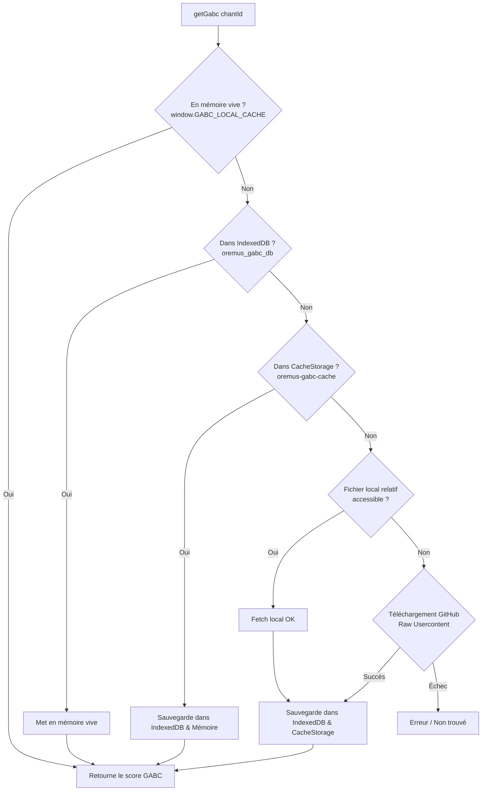

# Architecture des Modules Grégoriens & Streaming GABC

Ce document détaille le fonctionnement, le découpage en paquets et le système de cache hybride (IndexedDB, CacheStorage & GitHub Usercontent) pour l'affichage des partitions grégoriennes (GABC) dans Oremus.

---

## 1. Vue d'Ensemble & Principe Fondamental

### Comportement par Défaut : 100% En Ligne & Zéro Mo
- À l'installation de l'application (qu'il s'agisse de la version Web, PWA ou de l'APK Android), **aucun chant grégorien volumineux n'est pré-embarqué** dans le paquet initial.
- L'APK reste ainsi ultra-léger (~15 Mo au lieu de plus de 100 Mo).
- Dès qu'un utilisateur ouvre un office ou une messe contenant des partitions grégoriennes, celles-ci sont téléchargées **à la demande** depuis GitHub Raw Usercontent :
  `https://raw.githubusercontent.com/bastonus/jgabc/master/`
- Chaque partition consultée est **automatiquement mise en cache local** (IndexedDB + CacheStorage), de sorte qu'elle ne sera plus jamais re-téléchargée lors des ouvertures ultérieures.

---

## 2. Découpage des Deux Paquets Téléchargeables (Hors-Ligne)

Pour les utilisateurs souhaitant une autonomie complète sans connexion réseau (ou en déplacement), deux paquets distincts sont disponibles dans **Paramètres > Moduli & Memoria** :

### Paquet 1 : Pack Liturgique (Messes & Heures)
- **Contenu** : Toutes les pièces grégoriennes utilisées dans le Missel et l'Office divin (Bréviaire).
  - Répertoire `gabc/` (1 989 pièces)
  - Répertoire `do_data/**/*.gabc` (3 341 pièces)
  - **Total** : **5 330 pièces**.
- **Taille** : ~2.8 Mo compressé gzip (5.39 Mo pack zippé, ~34 Mo JSON brut).
- **Fichier de distribution** : `data/gregorian_liturgy.json` et `dist_modules/liturgy.pack`.
- **Identifiant interne** : `gabc_liturgy`.
- **Clé de stockage** : `do_module_gabc_liturgy_installed`.

### Paquet 2 : Corpus Complet GregoBase (Répertoire Intégral)
- **Contenu** : L'intégralité du corpus catholique traditionnel conservé dans le dépôt :
  - `gabc/` + `do_data/`
  - `gregobase/` (19 837 pièces)
  - `litanies/` (123 pièces)
  - **Total** : **25 290 pièces**.
- **Taille** : ~6.4 Mo compressé gzip (16.66 Mo pack zippé, ~48 Mo JSON brut).
- **Fichier de distribution** : `data/gregorian_all.json` et `dist_modules/gabc.pack`.
- **Identifiant interne** : `gabc_all`.
- **Clé de stockage** : `do_module_gabc_all_installed`.

---

## 3. Chaîne de Résolution en Cascade (`js/gregorian_db.js`)

Lors de la requête d'un chant via `window.gregorianDB.getGabc(chantId)` :



### Chemins d'accès GitHub résolus :
1. `gabc/${cleanId}.gabc`
2. Si numérique (`^\d+$`) : `gregobase/${cleanId}.gabc`
3. `do_data/${cleanId}`
4. `litanies/${cleanId}.gabc`
5. `gregobase/${cleanId}`

---

## 4. Ingestion Ultra-Rapide dans IndexedDB

Pour insérer 25 000 pièces dans le navigateur sans bloquer le thread UI principal :
- `js/gregorian_db.js` procède par **transactions par lots de 500 entrées** (`idbPutBatch`).
- La barre de progression reflète à la fois le téléchargement HTTP du JSON et la vitesse d'écriture dans la base IndexedDB locale (`oremus_gabc_db`, objectStore `chants`).
- Le processus est interruptible via `cancelCheck` si l'utilisateur appuie sur le bouton **Annuler**.

---

## 5. Interface Utilisateur & Gestionnaire (`OremusModuleManager`)

Dans `js/divinum_officium.js` :
- `OremusModuleManager.modules` gère :
  - `gabc_liturgy`
  - `gabc_all`
  - `saints` (Iconographia Sanctorum)
- **Universalité** : Le groupe `#settingsGroupModules` est actif sur **toutes les plateformes** (Web, PWA sur navigateur mobile/desktop, et APK Android natif).
- **Modale de première activation** (`#modulePromptModal`) :
  - S'affiche la première fois que l'utilisateur active le chant grégorien dans l'application (via le switch des paramètres ou le toggle de la barre de messe).
  - Propose clairement les 3 choix :
    1. *Pack Liturgique* (5 330 pièces, ~2.8 Mo)
    2. *Corpus Complet* (25 000+ pièces, ~6.4 Mo)
    3. *Rester en ligne* (0 Mo - Chargement à la volée GitHub)

---

## 6. Outils de Génération & Scripts de Build

| Fichier | Rôle |
|---|---|
| `tools/build_modules.mjs` | Parcourt le dépôt, extrait les 5 330 pièces liturgiques et les 25 290 pièces totales, génère `data/gregorian_liturgy.json`, `data/gregorian_all.json`, et produit les archives `.pack`. |
| `tools/pack_zip.py` | Utilitaire Python haute performance créant les archives ZIP standard sans overhead (~8 secondes pour 25k fichiers). |
| `tools/sync_apk_assets.mjs` | Synchronise les fichiers requis vers `www/` et `android/.../assets/public/` tout en **excluant expressément** les JSON volumineux (`gregorian_all.json`, `gregorian_liturgy.json`) afin que le bundle de l'APK reste ultra-léger. |

---

## 7. Commandes Utiles pour les Développeurs / Nouveaux Agents

### Reconstruire les paquets hors-ligne :
```bash
node tools/build_modules.mjs
```

### Synchroniser le projet avec www/ et l'APK Android :
```bash
node tools/sync_apk_assets.mjs
```

### Compiler l'APK Android (Debug ou Release) :
```bash
cd android
./gradlew assembleDebug
# ou
./gradlew assembleRelease
```
